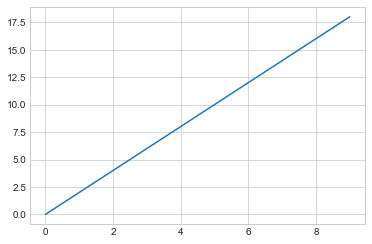

```python
import pandas as pd
data = pd.read_csv('integerArray.txt', header = None)
```

## Brute force method


```python
def bruteForceCount(arr):
    count = 0
    for i in range(len(arr)):
        for j in range(i + 1, len(arr)):
            if arr[i] > arr [j]:
                count = count + 1
                #print(count)
    return count 
```


```python
arr = [1, 2, 5, 6, 4, 0, 10, 1]
bruteForceCount(arr)
```


    12


## Q1 count inversion


```python
def mergeSortInversion(arr):
    
    # define base case
    if len(arr) == 1:
        return arr, 0
    else:
        # define two sublist
        left = arr[:int(len(arr)/2)]
        right = arr[int(len(arr)/2):]
        
        # recursion, return left and right are the sorted sublists
        left, leftCount = mergeSortInversion(left)
        right, rightCount = mergeSortInversion(right)

        # the sorted list
        lsorted = []
        
        i = 0 # index of left sublist
        j = 0 # index of right sublist
        inversions = leftCount + rightCount
        
        while i < len(left) and j < len(right):
            if left[i] <= right[j]:
                # not an inversion
                lsorted.append(left[i])
                i = i + 1
            else:
                # an inversion case
                lsorted.append(right[j])
                j = j + 1
                inversions = inversions + len(left) - i
         
        # conbime the remaining sublist, note only one of left[i:] and right[j:] is not null
        lsorted = lsorted + left[i:]
        lsorted = lsorted + right[j:]
    
    return lsorted, inversions               
```

## simulation to compute average inversions


```python
import numpy as np
totalCount = 0

for i in range(1000):
    arr = np.random.permutation(10)
    arrsot, count = mergeSortInversion(arr)
    totalCount = totalCount + count
    
aveCount = totalCount/1000
```


```python
x = list(range(10))
```


```python
y = [2*i for i in x]
```


```python
%matplotlib inline
import matplotlib.pyplot as plt
plt.style.use('seaborn-whitegrid')
```


```python
fig = plt.figure()
ax = plt.axes()
ax.plot(x, y);
```





```python
y
```


    [[0, 1, 2, 3, 4, 5, 6, 7, 8, 9, 0, 1, 2, 3, 4, 5, 6, 7, 8, 9],
     [0, 1, 2, 3, 4, 5, 6, 7, 8, 9, 0, 1, 2, 3, 4, 5, 6, 7, 8, 9],
     [0, 1, 2, 3, 4, 5, 6, 7, 8, 9, 0, 1, 2, 3, 4, 5, 6, 7, 8, 9],
     [0, 1, 2, 3, 4, 5, 6, 7, 8, 9, 0, 1, 2, 3, 4, 5, 6, 7, 8, 9],
     [0, 1, 2, 3, 4, 5, 6, 7, 8, 9, 0, 1, 2, 3, 4, 5, 6, 7, 8, 9],
     [0, 1, 2, 3, 4, 5, 6, 7, 8, 9, 0, 1, 2, 3, 4, 5, 6, 7, 8, 9],
     [0, 1, 2, 3, 4, 5, 6, 7, 8, 9, 0, 1, 2, 3, 4, 5, 6, 7, 8, 9],
     [0, 1, 2, 3, 4, 5, 6, 7, 8, 9, 0, 1, 2, 3, 4, 5, 6, 7, 8, 9],
     [0, 1, 2, 3, 4, 5, 6, 7, 8, 9, 0, 1, 2, 3, 4, 5, 6, 7, 8, 9],
     [0, 1, 2, 3, 4, 5, 6, 7, 8, 9, 0, 1, 2, 3, 4, 5, 6, 7, 8, 9]]


```python

```
